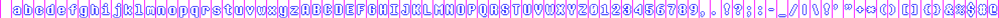

A [bitmap font renderer](https://love2d.org/wiki/love.graphics.newImageFont) for [love2d](https://love2d.org/) 0.10 using canvas and JS.

Worked fine in Firefox from day 1. Now works in Chrome too, after some serious hacking.
If you get sans-serif please refresh the page O:)

The font used in the example comes from here:  
<https://www.behance.net/gallery/31268855/Determination-Better-Undertale-Font>

## What it does

```javascript
var s = 2;
bitmapFontRenderer({
    font: 'DeterminationMonoWeb',
    ext: 'woff',
    size: 20*s,
    color: '#FFF',
    splitColor: '#F0F',
    splitW: s,
    gap: s,
    characters: ' abcdefghijklmnopqrstuvwxyzABCDEFGHIJKLMNOPQRSTUVWXYZ0123456789,.!?;:-_/|\\!\'"+*()[]{}&%$#@',
    //roundTo: 64,
    draw: function(c, ch, x, y, o) {
        c.fillStyle = '#00F';
        c.fillText(ch, x-s, y);
        c.fillText(ch, x+s, y);
        c.fillText(ch, x, y-s);
        c.fillText(ch, x, y+s);
        c.fillStyle = o.color;
        c.fillText(ch, x, y);
    }
});
```

and you get...



Use **Right click > Save image as...** to save it


## Params

* all units in pixels
* `font` and `ext` define the font family and filename to use
* `size` determines the font height
* `color` sets the font rendering color (ommit if you just want to render the splits in isolation)
* `splitColor` sets the split color, ie. colored gaps between colors, searched for by love2d. (ommit if you just want to render the font itself and overlay the splits in photoshop/gimp/etc)
* `splitW` sets the split width (use 1 or more so love2d works)
* `gap` is only relevant for giving characters space for effects such as strokes, shadows, etc.
* `characters` is the set of characters to render. save these for usage in love2d too
* `roundTo`, if set, sets the image size to the nearest multiple of the number given (ex: 64)
* `draw` is an optional function. if set, is used to render each character. signature is `function(c, ch, x, y, o)` where `c` is the context, `ch` character being rendered, `x` and `y` are coordinates and `o` are the options passed to the main function.


## TODO

* add simple form GUI
* increase browser compatibility
